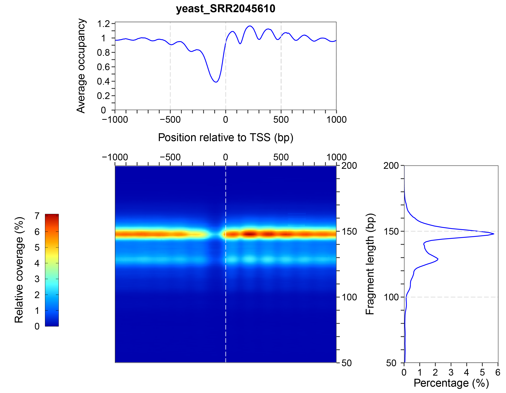
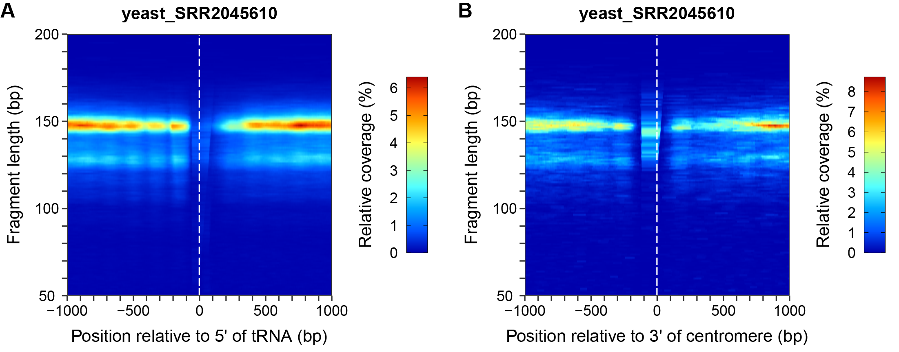
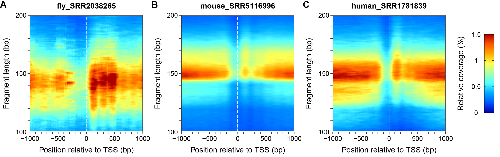
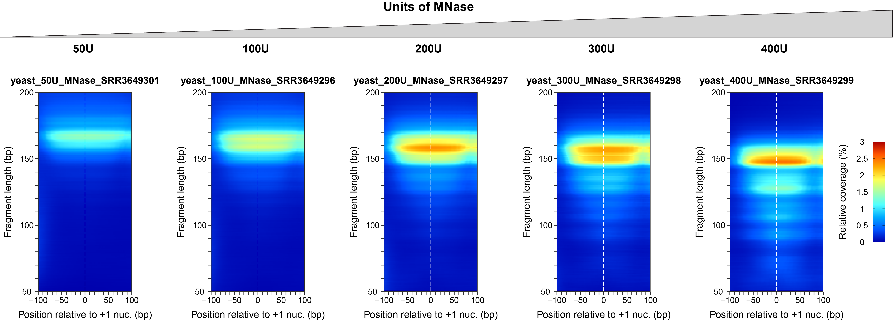

## plot2DO: Plot 2D Occupancies
Micrococcal nuclease digestion followed by deep sequencing (MNase-seq) is the most used method to investigate nucleosome organization on a genome-wide scale. We present **plot2DO**, a flexible tool for evaluating the quality of MNase-seq and MNase-ChIP-seq data, and for visualizing the distribution of nucleosomes near the functional regions of the genome. Apart from MNase-seq data analysis, **plot2DO** was also used to investigate DNA fragments obtained in other types of experiments, such as ChIP-seq, ATAC-seq, and chemical cleavage mapping. In principle, **plot2DO** can be used to analyze the amount of DNA that is obtained from different regions of the genome, and the corresponding distribution of fragment sizes for each region, independent of the protocol that is used to generate the short DNA fragments.

**plot2DO** is an open source package written in R, which can be used for computing and visualizing the two-dimensional (2D) occupancies of genomic data (e.g. MNase-seq, MNase-ChIP-seq, etc.). Instead of using the typical one-dimensional (1D) occupancy/coverage, obtained by stacking all the mapped reads regardless of their lengths, many times it is more informative to compute the relative occupancy given by DNA fragments of specific lengths in a matrix form.


## Download
The easiest way to download this package is by using the GitHub interface (click the green **Clone or download** button). If you want to download the package from the terminal, then you need to install first a `git` client of your choice (follow the instructions from `http://git-scm.com/download`). After `git` has been installed, run the following command from the folder where you want to download the **plot2DO** package:
```
$ git clone https://github.com/rchereji/plot2DO.git
```
Note that it is important to put the provided `annotations` folder in the same main folder as the **plot2DO** script (*i.e.* the file `plot2DO.R` should be located outside of the `annotations` folder).

In order to be able to run **plot2DO**, you will need to have R (version >= 3.5.0) installed on your computer, together with a few R packages. To install the R statistical computing environment, download the latest precompiled binary distributions from the following website: `http://cran.r-project.org`. To install all other dependencies, run the provided R script `plot2DO_setup.R`:
```
$ Rscript plot2DO_setup.R
```

The GNU `wget` package may be required (if the sequencing reads are provided in a BED-formatted file), and it is not installed by default in Windows and macOS, and should be downloaded and installed separately. The Windows binary executable file can be obtained from the following website: `https://www.gnu.org/software/wget/faq.html#download`. To install `wget` on a Mac computer, first install the Homebrew package manager (`https://brew.sh`), by running the following command in the terminal:
```
$ ruby -e "$(curl -fsSL https://raw.githubusercontent.com/Homebrew/install/master/install)"
```
After Homebrew has been installed, run the following command to install the `wget` package:
```
$ brew install wget
```

## Usage
After the R packages have been installed, you can execute **plot2DO** from a terminal. To list all the available options of **plot2DO**, run the following command:
```
$ Rscript plot2DO.R --help                                                                               
Usage: plot2DO.R [options]


Options:
        -f FILE, --file=FILE
                Name of the file containing aligned sequencing data [options: BAM or BED file]

        -t TYPE, --type=TYPE
                Type of distribution to plot [options: occ, dyads, fivePrime_ends, threePrime_ends; default = occ]

        -g GENOME, --genome=GENOME
                Genome version
                [options: sacCer3 (default) (S. cerevisiae); EF2 (S. pombe); dm3, dm6 (D. melanogaster);
                ce10, ce11 (C. elegans); mm9, mm10 (M. musculus);
                hg18, hg19, hg38 (H. sapiens); tair10 (A. thaliana)]

        -r REFERENCE, --reference=REFERENCE
                Reference points to be aligned [options: TSS (default), TTS, Plus1]

        -s SITES, --sites=SITES
                User-provided sites to be aligned (BED file)

        -a ALIGN, --align=ALIGN
                Points of the provided intervals to be aligned? [options: center (default), fivePrime, threePrime]

        --siteLabel=SITELABEL
                Label for the aligned sites [default = Sites]

        -l MINLENGTH, --minLength=MINLENGTH
                The smallest DNA fragment to be considered [default = 50]

        -L MAXLENGTH, --maxLength=MAXLENGTH
                The largest DNA fragment to be considered [default = 200]

        -u UPSTREAM, --upstream=UPSTREAM
                Length of the upstream region to be plotted [default = 1000]

        -d DOWNSTREAM, --downstream=DOWNSTREAM
                Length of the downstream region to be plotted [default = 1000]

        -m COLORSCALEMAX, --colorScaleMax=COLORSCALEMAX
                Maximum value on the color scale (e.g. 0.02)

        --simplifyPlot=SIMPLIFYPLOT
                Simplify the plot (show only the 2D heat map) [options: on, off (default)]

        --squeezePlot=SQUEEZEPLOT
                Simplify the plot and squeeze the heat map [options: on, off (default)]

        -h, --help
                Show this help message and exit
```

Almost all arguments of **plot2DO** are optional. If an argument is not specified, it will take its default value, as indicated above. The only required argument for **plot2DO** is the name of the file that contains the aligned genomic data (in BAM or BED format), which is provided using the `-f/--file` argument. A minimal example, which generates the default 2D occupancy (2DO) plot (around TSS, all DNA fragments with the lengths between 50 - 200 bp, 2kb windows centered on TSS, yeast DNA), is given below:
```
$ Rscript plot2DO.R --file=yeast_SRR2045610.bam
```
where `yeast_SRR2045610.bam` is a test BAM file containing paired-end reads, which were aligned to the yeast genome. This command will generate Figure 1.

||
|:--:|
| **Figure 1.** *The three panels that are generated by plot2DO: (1) 2D occupancy (2DO) plot (central heat map) indicating the relative coverage of the DNA fragments of specified lengths, at different locations relative to the reference points (transcription start sites (TSSs) in this case). The red color indicates a high coverage, while dark blue indicates zero coverage. (2) One-dimensional occupancy (top panel), generated by stacking DNA fragments of all lengths shown in the heat map. (3) Fragment length histogram (right panel) indicating the percentage corresponding to each DNA fragment size, from the whole sample of sequenced reads.* |

By default, **plot2DO** aligns the TSSs, and plots the coverage obtained by stacking the footprints of the of the entire fragments that were sequenced (Fig. 1). One may want to plot the distribution of the DNA fragments at other locations from the genome (e.g. +1 nucleosomes), or to plot the distribution of the fragment centers (nucleosome dyads) instead of the coverage of the entire fragments. When multiple samples are compared, the color scale needs to be specified in a consistent way for all plots. These options are all possible using the following command line flags:
```
$ Rscript plot2DO.R --file=yeast_SRR2045610.bam --type=dyads --reference=Plus1 --type=dyads
```
This command will generate Figure 2.

||
|:--:|
| **Figure 2.** *Distribution of nucleosome dyads near the typical positions of +1 nucleosomes. This special case of 2DO plot is also known as a V-plot* |

Apart from the usual alignments, using the TSS, TTS or +1 nucleosomes as reference points, one can also align specific lists of reference points, provided in the form of a BED file. For convenience, we provide some of the yeast features that one may want to examine (tRNA genes, origins of replication, centromeres), and below are two examples of how one can use **plot2DO** to inspect a specific list of loci.
```
$ Rscript plot2DO.R --file=yeast_SRR2045610.bam --sites=annotations/Yeast_tRNA_genes.bed --align=fivePrime --siteLabel=tRNA --simplifyPlot=on
$ Rscript plot2DO.R --file=yeast_SRR2045610.bam --sites=annotations/Yeast_centromeres.bed --align=threePrime --siteLabel=centromere --simplifyPlot=on

```
Notice that using the `--simplifyPlot=on` option, it is possible to plot only the 2DO panel without the panels showing the one-dimensional occupancy and the histogram of fragment lengths, and this makes it easier to combine multiple such panels in a single figure (Fig. 3).

||
|:--:|
| **Figure 3.** *2D occupancy plots showing the distribution of sequencing data near the yeast (A) tRNA genes, aligned at their 5' ends, and (B) centromeres, aligned at their 3' ends.* |

**plot2DO** can process sequencing data from multiple organisms, such as *Saccharomyces cerevisiae*, *Drosophila melanogaster*, *Caenorhabditis elegans*, *Mus musculus* and *Homo sapiens*. The following genome versions are available for these organisms: yeast — sacCer3; fly — dm3, dm6; worm — ce10, ce11; mouse — mm9, mm10; human — hg18, hg19, hg38. For the multicellular organisms the alignment of +1 nucleosomes is not possible, as the locations of these nucleosomes could vary from cell type to cell type, and these positions should be identified separately in each cell type. Here are a few examples of commands used to examine the distribution of reads at the TSSs of the aforementioned higher organisms:
```
$ Rscript plot2DO.R --file=fly_SRR2038265.bam -g dm3 -m 0.015 --simplifyPlot=on --minLength=100 --maxLength=200
$ Rscript plot2DO.R --file=mouse_SRR572708.bam -g mm10 -m 0.015 --simplifyPlot=on --minLength=100 --maxLength=200
$ Rscript plot2DO.R --file=human_SRR1781839.bam -g hg19 -m 0.015 --simplifyPlot=on --minLength=100 --maxLength=200
```
The figures resulted from these commands are shown in Figure 4.

||
|:--:|
| **Figure 4.** *2D occupancy plots showing the degree of chromatin digestion and the distribution of sequencing data near the TSS in (A) fly, (B) mouse, and (C) human.* |

If one wants to check only a small genomic region (e.g. +1 nucleosomes), the `--squeezePlot=on` option is very handy. Below are a few examples:
```
$ Rscript plot2DO.R -f yeast_50U_MNase_SRR3649301.bam -g sacCer3 -r Plus1 -m 0.03 -u 100 -d 100 --squeezePlot=on
$ Rscript plot2DO.R -f yeast_100U_MNase_SRR3649296.bam -g sacCer3 -r Plus1 -m 0.03 -u 100 -d 100 --squeezePlot=on
$ Rscript plot2DO.R -f yeast_200U_MNase_SRR3649297.bam -g sacCer3 -r Plus1 -m 0.03 -u 100 -d 100 --squeezePlot=on
$ Rscript plot2DO.R -f yeast_300U_MNase_SRR3649298.bam -g sacCer3 -r Plus1 -m 0.03 -u 100 -d 100 --squeezePlot=on
$ Rscript plot2DO.R -f yeast_400U_MNase_SRR3649299.bam -g sacCer3 -r Plus1 -m 0.03 -u 100 -d 100 --squeezePlot=on
```
The figures resulted from these commands are shown as panels in Figure 5.

||
|:--:|
| **Figure 5.** *A titration of MNase produces different levels of chromatin digestion, and different sizes for the undigested fragments of DNA. Plus 1 nucleosomes are particularly sensitive to MNase, as they are located adjacent to the nucleosome free regions (the most accessible regions of the genome).* |


## Quality check of MNase-seq data
**plot2DO** is very useful for inspecting the degree of digestion in MNase-seq and MNase-ChIP-seq experiments. Figure 6 shows three examples of 2DO plots that originate from an under-digested sample, a properly-digested sample, and an over-digested sample.

||
|:--:|
| **Figure 6.** *Plot2DO offers a quick quality check for MNase-seq experiments. The left panel shows an under-digested MNase-seq sample: untrimmed linkers are still attached to nucleosomes (fragment length > 147 bp) and short fragments, protected by other proteins found in the promoters, are still not fully digested by MNase. The middle panel shows a properly digested MNase-seq sample: most of the undigested fragments originate from well trimmed nucleosome core particles, and have a length of about 147 bp. The right panel shows an over-digested MNase-seq sample: nucleosome core particles are invaded by MNase, and most of the undigested fragments have a length smaller than 147 bp.* |


## Data used in examples
The data that were used in the examples above were downloaded from GEO database. The corresponding accession numbers are listed below:

| Filename | GEO accession number for the raw data |
| ------------- | ------------- |
| yeast_SRR2045610.bam | [GSM1700669](https://www.ncbi.nlm.nih.gov/geo/query/acc.cgi?acc=GSM1700669) |
| yeast_50U_MNase_SRR3649301.bam | [GSM2193286](https://www.ncbi.nlm.nih.gov/geo/query/acc.cgi?acc=GSM2193286) |
| yeast_100U_MNase_SRR3649296.bam | [GSM2193281](https://www.ncbi.nlm.nih.gov/geo/query/acc.cgi?acc=GSM2193281) |
| yeast_200U_MNase_SRR3649297.bam | [GSM2193282](https://www.ncbi.nlm.nih.gov/geo/query/acc.cgi?acc=GSM2193282) |
| yeast_300U_MNase_SRR3649298.bam | [GSM2193283](https://www.ncbi.nlm.nih.gov/geo/query/acc.cgi?acc=GSM2193283) |
| yeast_400U_MNase_SRR3649299.bam | [GSM2193284](https://www.ncbi.nlm.nih.gov/geo/query/acc.cgi?acc=GSM2193284) |
| fly_SRR2038265.bam | [GSM1694824](https://www.ncbi.nlm.nih.gov/geo/query/acc.cgi?acc=GSM1694824) |
| mouse_SRR5116996.bam | [GSM2430825](https://www.ncbi.nlm.nih.gov/geo/query/acc.cgi?acc=GSM2430825) |
| human_SRR1781839.bam | [GSM1425454](https://www.ncbi.nlm.nih.gov/geo/query/acc.cgi?acc=GSM1425454) |


## Extra functions
Reasonable minimum (`--minLength`) and maximum (`--maxLength`) fragment sizes to be displayed in the 2D occupancy plot can be obtained by inspecting the histogram of all DNA fragment lengths that are present in the sample. This can be done using the additional function **computeLengthHistogram**. The available options are shown below:
```
$ Rscript computeLengthHistogram.R --help
Usage: computeLengthHistogram.R [options]


Options:
        -f FILES, --files=FILES
                Data file names, separated by commas only (BAM format)

        -l MINLENGTH, --minLength=MINLENGTH
                The smallest DNA fragment to be considered [default = 0]

        -L MAXLENGTH, --maxLength=MAXLENGTH
                The largest DNA fragment to be considered [default = 500]

        -s STATISTICS, --statistics=STATISTICS
                Include statistics in the plot [options: on, off; default = on]

        -o OUTPUTS, --outputs=OUTPUTS
                Types of outputs to be generated, separated by commas only [options: pdf, csv, RData; default = pdf,csv,RData]

        -h, --help
                Show this help message and exit
```


## License
**plot2DO** is freely available under the MIT License.


## Citation  
If you use this program in your research, please cite **plot2DO** as:  
Beati P., Chereji R.V. (2020) Creating 2D Occupancy Plots Using plot2DO. In: Kidder B. (eds) Stem Cell Transcriptional Networks. Methods in Molecular Biology, vol 2117. Humana, New York, NY  
DOI: https://doi.org/10.1007/978-1-0716-0301-7_5
