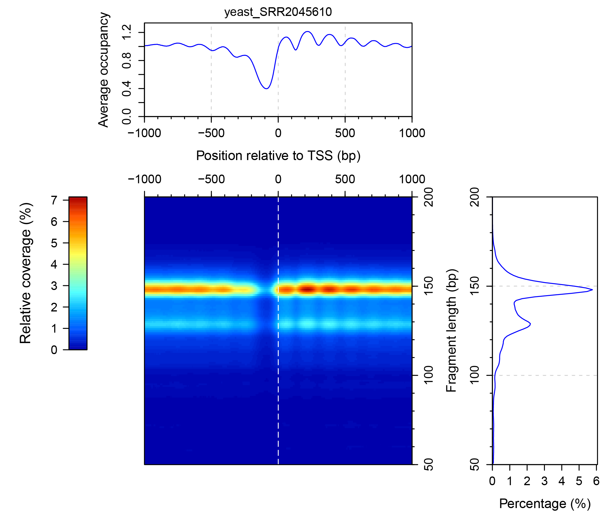
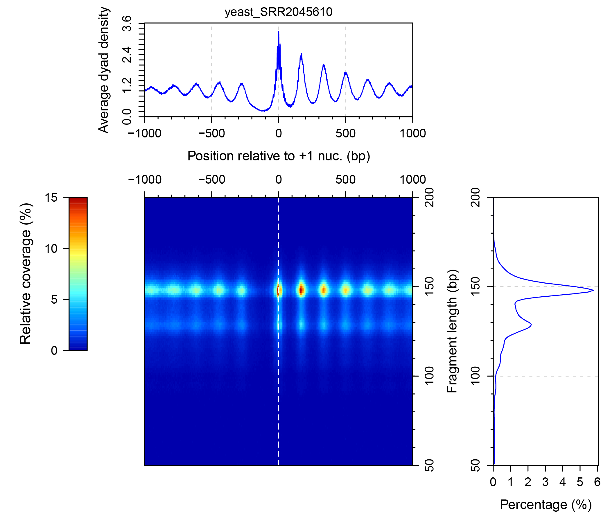
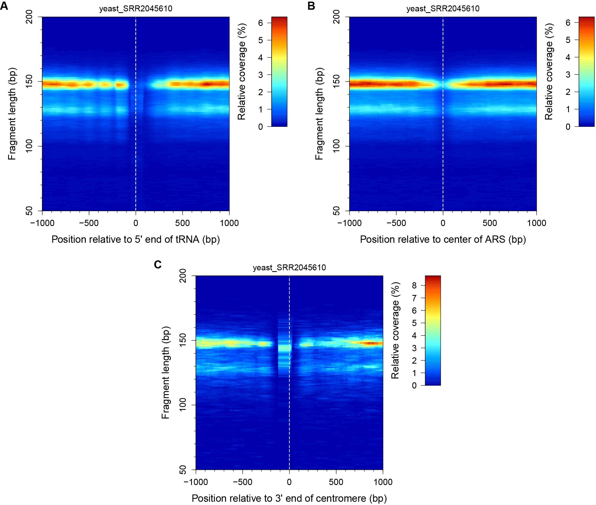
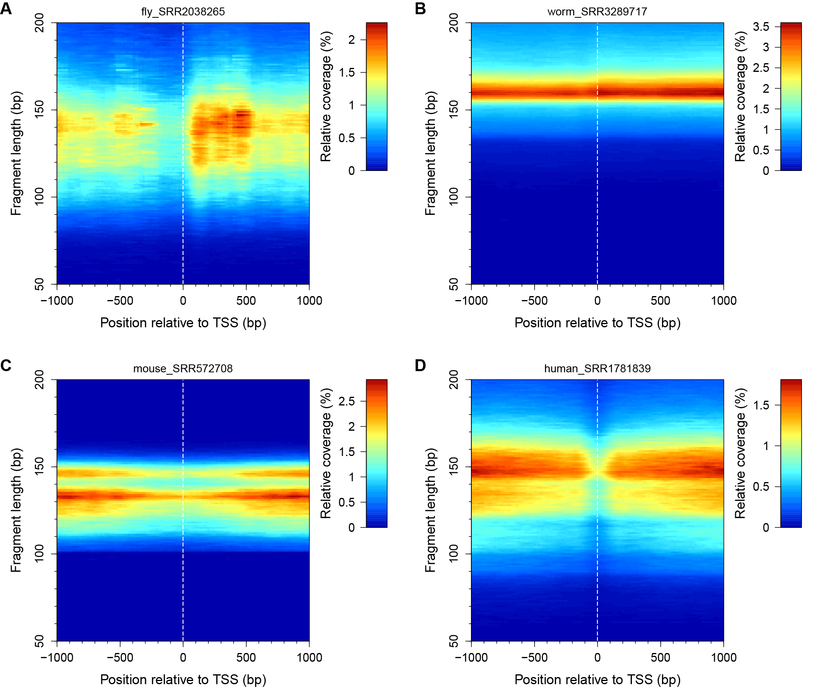
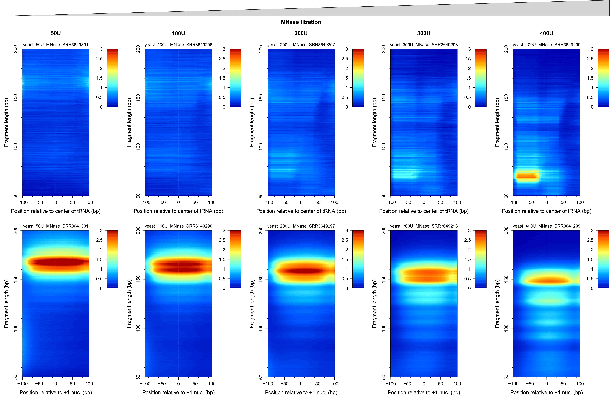

## plot2DO: Plot 2D Occupancies
Micrococcal nuclease digestion followed by deep sequencing (MNase-seq) is the most used method to investigate nucleosome organization on a genome-wide scale. We present **plot2DO**, a software package for creating 2D occupancy plots, which allows biologists to evaluate the quality of MNase-seq data and to visualize the distribution of nucleosomes near the functional regions of the genome (e.g. gene promoters, origins of replication, etc.).

**plot2DO** is an open source package written in R that can be launched from the command line in a terminal, which can be used for computing and visualizing the two-dimensional (2D) occupancies of genomic data (e.g. MNase-seq or MNase-ChIP-seq data). Instead of using the typical one-dimensional (1D) occupancy/coverage, obtained by stacking all the mapped reads regardless of their lengths, it is more informative to compute the relative occupancy given by DNA fragments of specific lengths in a matrix form.


## Download
The easiest way to download this package is by using the GitHub interface (click the green **Clone or download** button). If you want to download the package from the terminal, then you need to install first a `git` client of your choice, using the package manager that is available for your system. For example, in Ubuntu or other Debian-based distributions of Linux, you can use `apt-get`:
```
$ sudo apt-get install git
```
while in Fedora, CentOS, or Red Hat Linux, you can use `yum`:
```
$ sudo yum install git
```
Installers for Windows and OSX are available for download at the following websites: `http://git-scm.com/download/win` and `http://git-scm.com/download/mac`. After `git` has been installed, run the following command from the folder where you want to download the **plot2DO** package:
```
$ git clone https://github.com/rchereji/plot2DO.git
```

In order to be able to run **plot2DO**, you will need to have R installed on your computer, together with the following R packages.


## Dependencies
**plot2DO** uses the following R packages: `biomaRt, caTools, colorRamps, GenomicRanges, optparse, rtracklayer, Rsamtools`. To install these packages, open R and execute the following commands:
```{r}
> # Install caTools, colorRamps and optparse packages from CRAN:
> install.packages(c("caTools", "colorRamps", "optparse"))
>                  
> # Get the latest version of Bioconductor:
> source("https://bioconductor.org/biocLite.R")
> biocLite()
> 
> # Install the remaining Bioconductor packages:
> biocLite(c("biomaRt", "GenomicRanges", "rtracklayer", "Rsamtools"))
```


## Usage
After the R packages have been installed, you can execute **plot2DO** from a terminal. The only required input is the name of the file that contains the aligned genomic data (in BAM or BED format). To generate the default 2D occupancy (2DO) plot (around TSS, all DNA fragments with the lengths between 50 - 200 bp, 2kb windows centered on TSS, yeast DNA), run the following command: 
```
$ Rscript plot2DO.R --file=yeast_SRR2045610.bam
```
where `yeast_SRR2045610.bam` is a test BAM file containing paired-end reads, which were aligned to the yeast genome. This command will generate Figure 1.

||
|:--:| 
| **Figure 1.** *The three panels that are generated by plot2DO. (1) The 2D occupancy (2DO) plot -- heat map indicating the relative coverage of the DNA fragments of specified lengths, at different locations relative to the reference/alignment points (transcription start sites, or TSSs, in this case). The color red indicates a high coverage, while dark blue indicates zero coverage. (2) The one-dimensional occupancy/coverage (top panel), generated by stacking DNA fragments of all lengths shown in the heat map. (3) Fragment length histogram (right panel) -- indicating the percentage corresponding to each DNA fragment size, from the whole sample of sequenced reads.* |

By default, **plot2DO** aligns the TSSs, and plots the coverage obtained by stacking the footprints of the of the entire fragments that were sequenced (Fig. 1). One may want to plot the distribution of the DNA fragments at other locations from the genome (e.g. +1 nucleosomes), or to plot the distribution of the fragment centers (nucleosome dyads) instead of the coverage of the entire fragments. When multiple samples are compared, the color scale needs to be specified in a consistent way for all plots. These options are all possible using the following command line flags:
```
$ Rscript plot2DO.R --file=yeast_SRR2045610.bam --type=dyads --reference=Plus1 --colorScaleMax=0.15
```
This command will generate Figure 2.

||
|:--:| 
| **Figure 2.** *Distribution of nucleosome dyads near the typical positions of +1 nucleosomes. This special case of 2DO plot is also known as a V-plot.* |

Apart from the usual alignments, using the TSS, TTS or +1 nucleosomes as reference points, one can also align specific lists of reference points, provided in the form of a BED file. For convenience, we provide some of the yeast features that one may want to examine (tRNA genes, origins of replication, centromeres), and below are a few examples of how one can use **plot2DO** to inspect a specific list of loci.
```
$ Rscript plot2DO.R --file=yeast_SRR2045610.bam --sites=Annotations/Yeast_tRNA_genes.bed --align=fivePrime --siteLabel=tRNA --simplifyPlot=on
$ Rscript plot2DO.R --file=yeast_SRR2045610.bam --sites=Annotations/Yeast_ARS_locations.bed --align=center --siteLabel=ARS --simplifyPlot=on
$ Rscript plot2DO.R --file=yeast_SRR2045610.bam --sites=Annotations/Yeast_centromeres.bed --align=threePrime --siteLabel=centromere --simplifyPlot=on
```
Notice that using the `--simplifyPlot=on` option, it is possible to plot only the 2DO panel (without the panels showing the one-dimensional occupancy and the histogram of fragment lengths), to make it easier to combine multiple such panels in a single figure (Fig. 3).

||
|:--:| 
| **Figure 3.** *2DO plots showing the distribution of sequencing data near the yeast tRNA genes (A), origins of replication (B), and centromeres (C).* |

Plot2DO can process sequencing data from multiple organisms: yeast, fly, worm, mouse and human. The available genome versions that are available are the following: yeast -- sacCer3; fly -- dm3, dm6; worm -- ce10, ce11; mouse -- mm9, mm10; human -- hg18, hg19. For the multicellular organisms the alignment of +1 nucleosomes is not possible, as the locations of these nucleosomes could vary from cell type to cell type, and these positions should be identified in each cell type, separately. Here are a few examples of commands used to examine the distribution of reads at the TSS of the aforementioned higher organisms.

```
$ Rscript plot2DO.R --file=fly_SRR2038265.bam --organism=dm3 --reference=TSS --simplifyPlot=on
$ Rscript plot2DO.R --file=worm_SRR3289717.bam --organism=ce10 --reference=TSS --simplifyPlot=on
$ Rscript plot2DO.R --file=mouse_SRR572708.bam --organism=mm10 --reference=TSS --simplifyPlot=on
$ Rscript plot2DO.R --file=human_SRR1781839.bam --organism=hg19 --reference=TSS --simplifyPlot=on
```
The figures resulted from these commands are shown in Figure 4.

||
|:--:| 
| **Figure 4.** *2DO plots showing the distribution of sequencing data near the TSS in fly (A), worm (B), mouse (C), and human (D).* |

If one wants to check only a small genomic region (e.g. all tRNA genes or +1 nucleosomes), the `--squeezePlot=on` option is very handy. Below are a few examples:
```
$ Rscript plot2DO.R --file=yeast_50U_MNase_SRR3649301.bam --reference=Plus1 --upstream=100 --downstream=100 --squeezePlot=on
$ Rscript plot2DO.R --file=yeast_100U_MNase_SRR3649296.bam --reference=Plus1 --upstream=100 --downstream=100 --squeezePlot=on
$ Rscript plot2DO.R --file=yeast_200U_MNase_SRR3649297.bam --reference=Plus1 --upstream=100 --downstream=100 --squeezePlot=on
$ Rscript plot2DO.R --file=yeast_300U_MNase_SRR3649298.bam --reference=Plus1 --upstream=100 --downstream=100 --squeezePlot=on
$ Rscript plot2DO.R --file=yeast_400U_MNase_SRR3649299.bam --reference=Plus1 --upstream=100 --downstream=100 --squeezePlot=on
$
$ Rscript plot2DO.R --file=yeast_50U_MNase_SRR3649301.bam --sites=Annotations/Yeast_tRNA_genes.bed --upstream=100 --downstream=100 --squeezePlot=on
$ Rscript plot2DO.R --file=yeast_100U_MNase_SRR3649296.bam --sites=Annotations/Yeast_tRNA_genes.bed --upstream=100 --downstream=100 --squeezePlot=on
$ Rscript plot2DO.R --file=yeast_200U_MNase_SRR3649297.bam --sites=Annotations/Yeast_tRNA_genes.bed --upstream=100 --downstream=100 --squeezePlot=on
$ Rscript plot2DO.R --file=yeast_300U_MNase_SRR3649298.bam --sites=Annotations/Yeast_tRNA_genes.bed --upstream=100 --downstream=100 --squeezePlot=on
$ Rscript plot2DO.R --file=yeast_400U_MNase_SRR3649299.bam --sites=Annotations/Yeast_tRNA_genes.bed --upstream=100 --downstream=100 --squeezePlot=on
```
The figures resulted from these commands are shown as panels in Figure 5.

||
|:--:| 
| **Figure 5.** *A titration of MNase produces different levels of chromatin digestion, and different sizes for the undigested fragments of DNA. Plus 1 nucleosomes are particularly sensitive to MNase, as they are located next to the nucleosome free region (the most accessible regions of the genome), while tRNA genes are more resistant to MNase.* |

To list all the available options of plot2DO, run the following command in the terminal:
```
$ Rscript plot2DO.R --help                                                                               
Usage: plot2DO.R [options]


Options:
        -f FILE, --file=FILE
                Dataset file name [options: BED or BAM format]

        -t TYPE, --type=TYPE
                Types of distribution to plot [options: occ, dyads, fivePrime_ends, threePrime_ends; default = occ]

        -o ORGANISM, --organism=ORGANISM
                Genome version [options: sacCer3 (default), dm3, dm6, ce10, ce11, mm9, mm10, hg18, hg19]

        -r REFERENCE, --reference=REFERENCE
                Reference points to align [options: TSS (default), TTS, Plus1]

        -s SITES, --sites=SITES
                Reference points in BED format

        -a ALIGN, --align=ALIGN
                What points of the provided intervals to align? [options: center (default), fivePrime, threePrime]

        --siteLabel=SITELABEL
                Label for the aligned sites [default = Sites]

        -l MINLENGTH, --minLength=MINLENGTH
                The smallest DNA fragment to be considered [default = 50]

        -L MAXLENGTH, --maxLength=MAXLENGTH
                The largest DNA fragment to be considered [default = 200]

        -u UPSTREAM, --upstream=UPSTREAM
                Length of the upstream region that will be plotted [default = 1000]

        -d DOWNSTREAM, --downstream=DOWNSTREAM
                Length of the downstream region that will be plotted [default = 1000]

        -m COLORSCALEMAX, --colorScaleMax=COLORSCALEMAX
                Maximum value on the color scale (e.g. 0.02)

        --simplifyPlot=SIMPLIFYPLOT
                Simplify the plot (show only the 2D Occ.) [options: on, off (default)]

        --squeezePlot=SQUEEZEPLOT
                Simplify the plot (show only the 2D Occ.) and squeeze the heat map [options: on, off (default)]

        -h, --help
                Show this help message and exit
```


## Extra functions
The proper minimum (`--minLength`) and maximum (`--maxLength`) fragment sizes to be displayed in the 2D occupancy plot can be obtained by inspecting the histogram of all DNA fragment lengths that are present in the sample. This can be done using the additional function **computeLengthHistogram**. The available options are shown below:
```
$ Rscript computeLengthHistogram.R --help
Usage: computeLengthHistogram.R [options]


Options:
        -f FILES, --files=FILES
                Data file names, separated by commas only (BAM format)

        -l MINLENGTH, --minLength=MINLENGTH
                The smallest DNA fragment to be considered [default = 0]

        -L MAXLENGTH, --maxLength=MAXLENGTH
                The largest DNA fragment to be considered [default = 500]

        -s STATISTICS, --statistics=STATISTICS
                Include statistics in the plot [options: on, off; default = on]

        -o OUTPUTS, --outputs=OUTPUTS
                Types of outputs to be generated, separated by commas only [options: pdf, csv, RData; default = pdf,csv,RData]

        -h, --help
                Show this help message and exit
```


## Data used in examples
The data that were used in the examples above were downloaded from GEO database. The corresponding accession numbers are listed below:

| Filename | GEO accession number for the raw data |
| ------------- | ------------- |
| yeast_SRR2045610.bam | GSM1700669 |
| yeast_50U_MNase_SRR3649301.bam | GSM2193286 |
| yeast_100U_MNase_SRR3649296.bam | GSM2193281 |
| yeast_200U_MNase_SRR3649297.bam | GSM2193282 |
| yeast_300U_MNase_SRR3649298.bam | GSM2193283 |
| yeast_400U_MNase_SRR3649299.bam | GSM2193284 |
| fly_SRR2038265.bam | GSM1694824 |
| worm_SRR3289717.bam | GSM2098437 |
| mouse_SRR572708.bam | GSM1004654 |
| human_SRR1781839.bam | GSM1425454 |


## License
**plot2DO** is freely available under the MIT License.
